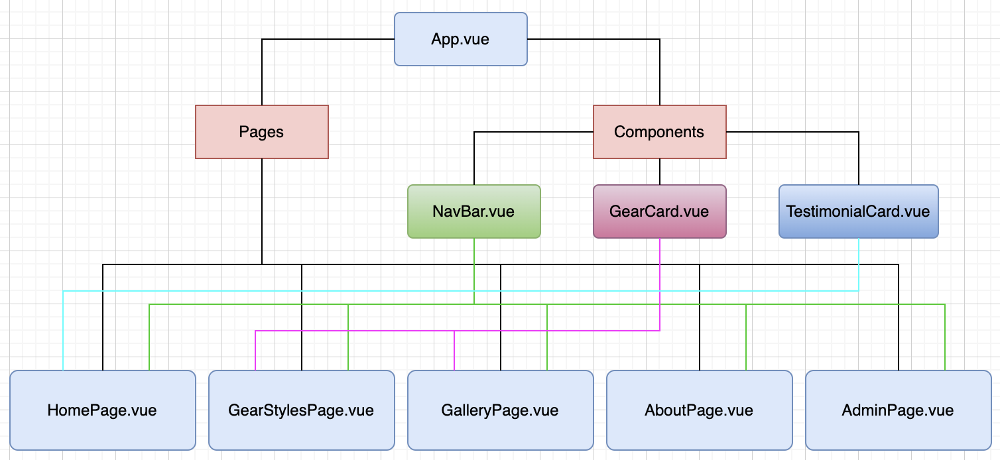
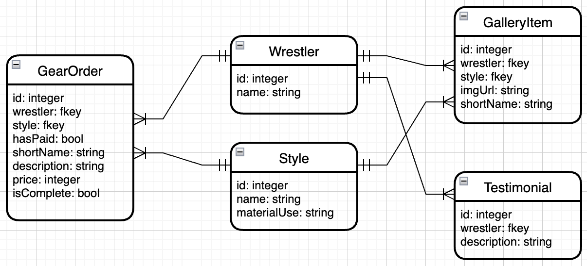

# Gear by Cashew

## Developed by Brad Lewis

---

## **_Concept_**

This is a site designed to showcase professional wrestling gear constructed by one of the top gear-makers in New England. For 3 years, Cashew has designed, fitted, and created gear for many wrestlers throughout the New England area, and has received stellar endorsements from his clients. Up to this point, the only way to contact Cashew to place an order was by word of mouth. This site creates an opportunity for Cashew to expand from casual recommendations for gear to a professional side hustle. The title "Gear by Cashew" was the original name of the business, but has since been updated to "Bump + Stitch".

---

## **_App Structure_**

**Component Hierarchy Diagram**

**Entity Relationship Diagram**

